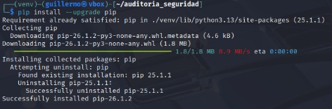
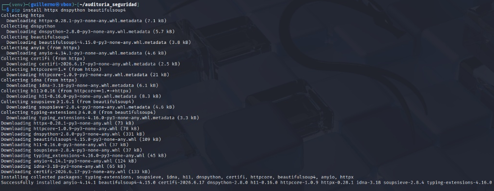
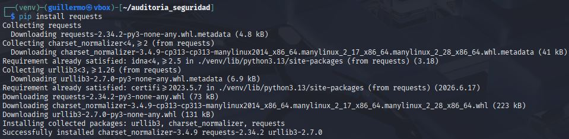

#  PassiveCMS-Audit

## 1. Descripzione
Il presente progetto consiste nello sviluppo e nell'implementazione di un modulo automatizzato progettato per la fase di ricognizione (recon) nell'ambito degli audit di sicurezza web.

Lo strumento è specializzato nel rilevamento passivo dei CMS (Content Management Systems), in particolare WordPress, utilizzando una metodologia di fingerprinting basata sull’analisi dei percorsi critici e dei file di configurazione esposti. A differenza degli scanner attivi, questo approccio consente di identificare lo stack tecnologico di un sito web senza generare traffico dannoso né allertare i sistemi di difesa (IDS/IPS), garantendo un audit discreto ed efficiente.

Il sistema è stato sviluppato in un ambiente di audit professionale (Kali Linux) e ottimizzato attraverso un processo di rifattorizzazione iterativa, integrando la gestione delle eccezioni, la convalida dello stato e i test unitari automatici per garantirne l’affidabilità negli ambienti di produzione.

## 2. Installazione di Python 3 su Linux
In Kali Linux: è sempre necessario utilizzare `sudo` per aggiornare i repository e installare i programmi (ad esempio: `sudo apt update` o `sudo apt install <nome_pacchetto>`). Questo perché il sistema richiede privilegi di amministratore per modificare i file di sistema e i database dei pacchetti.

Nei sistemi in cui l'utente è amministratore: in molte altre distribuzioni Linux (come Ubuntu), se l'utente appartiene al gruppo sudo, il sistema richiederà la password quando si utilizza il comando.

2.1 Aggiornare il repository e installarlo:

```bash
$ sudo apt update
```

```bash
$ sudo apt install python3
```

2.2. Comando per visualizzare l'ultima versione del programma:

```bash
$ python3 –version
```

## 3 Creazione la cartella e accedervi:

```bash
$ mkdir audit_sicurezza
```

```bash
$ cd audit_sicurezza
```

## 4. Creare l'ambiente virtuale denominato `venv` e verificare:

```bash
$ python3 -m venv venv
```

```bash
$ ls -l
```

## 5. Attivare tale ambiente:

```bash
$ source venv/bin/activate
```

## 6. Installazione delle librerie

```bash
$ pip install --upgrade pip
```



```bash
$ pip install httpx dnspython beautifulsoup4
```



## 7. Creazione delle directory e dei file:

```bash
$ mkdir core reports test
```

```bash
$ touch main.py core/__init__.py core/utils.py core/scanner.py core/scoring.py core/cms_detector.py reports/generator.py reports/__init__.py  tests/__init__.py tests/test_scanner.py
```

## 8. Installazione della libreria `requests`:

```bash
$ pip install requests
```



## 9. Struttura del progetto

```bash
$ tree -I "__pycache__|venv|.git"
```

```
|── auditoria_seguridad/
|   ├── core/               # Logica principale del rilevatore e della scansione
│    ├── cms_detector.py
│    ├── __init__.py
│    ├── scanner.py
│    ├── scoring.py
│    └── utils.py
|   ├── reports/            # Generazione di report
│    ├── generator.py
│    └── __init__.py
|   ├── tests/              # Test unitari
│    ├── __init__.py
│    └── test_scanner.py
├── main.py             # Punto di accesso all'applicazione
├── report.json         # Risultato dell'analisi in formato JSON
├── report.md           # Report generato in formato Markdown
└── test_cms.py         # Script di test specifico per il rilevatore
```
